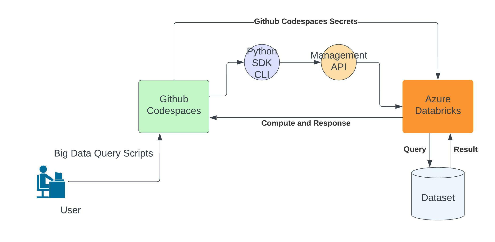

[](https://github.com/nogibjj/Big-Data-Script/actions/workflows/python-app.yml)
# Big-Data-Script
This is Qiheng's repo for ids 706 project 1 Write a Big Data Script that uses the Pandas API for Spark or Dask, detailed description could be found [here](https://noahgift.github.io/data-engineering-and-dataops/projects)
&nbsp;
## Project Structrue

&nbsp;
## Highlights
1. Have the isolated environment configured in `.devcontainer.json` and `Dockerfile`, so that the scripts can easily pull-to-run in other codespace computing resources

2. Set up compulsory `secret`s to connect codespace and databricks cluster, therefore enable direct query data in codespace using databricks

3. Configured github workflow so that CI/CD is realized in daily devlopment, and add status badge at the top of README
&nbsp;
## Usage
`./big_data_script.py cli-query --query QUERYTEXT`
&nbsp;
## Connection test
```
databricks clusters list --output JSON | jq
databricks fs ls dbfs:/
databricks jobs list --output JSON | jq
```
